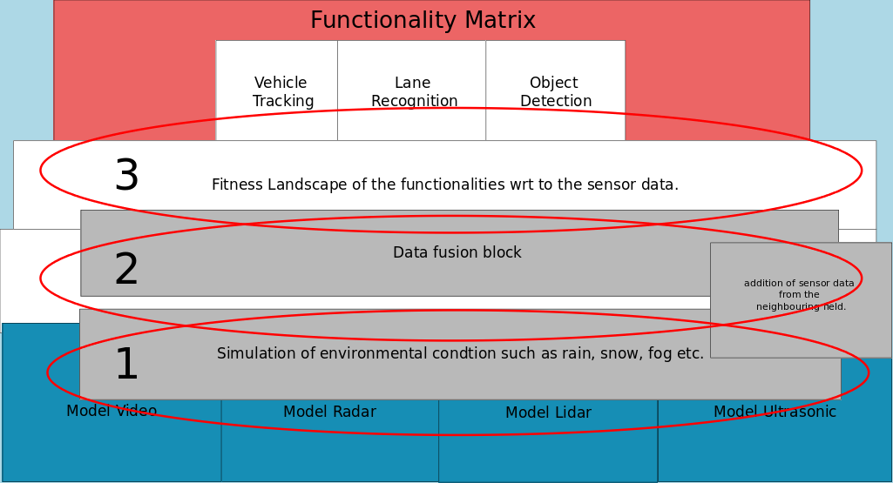

# README

### Software

Development of sensor model to support the rapid development and testing of downstream ADAS algorithms. Synthetic scene generation is performed using Hexagon VTD, which triggers dynamic scenarios through OpenSceneGraph and XML‑based OpenDrive.

The objective is to improve ADAS algorithm performance when sensor data is degraded by environmental conditions such as rain, fog, reflections, and other distortions. Potential solution approaches include:

1. Enhancing situational awareness within the same sensor snapshot
2. Correlating and fusing data across multiple heterogeneous sensors
3. Incorporating sensor information from neighbouring entities, such as nearby vehicles and infrastructure
4.  Decoupling of sensors to algorithms. This means that controllers themselves do not know where data has arrived from. It could be from a data from within the car environment or also from a different car.

    \
     

<figure><figcaption></figcaption></figure>

Challenges : Distortion can also happen during sensor fusion.&#x20;

Output is a fitness landscape - A 3-D graph with inputs being environmental conditions and output health of ADAS functionality. Attributes being reliability of results.

#### **Repositories and Submodules** 

<table data-view="cards"><thead><tr><th></th><th data-type="content-ref"></th><th data-hidden data-card-cover data-type="image">Cover image</th></tr></thead><tbody><tr><td>Motion Flow Priority Graph Sensors</td><td><a href="https://www.github.com/parabola-x2/MotionFlowPriorityGraphSensors">https://www.github.com/parabola-x2/MotionFlowPriorityGraphSensors</a></td><td><a href="https://images.unsplash.com/photo-1605035015406-54c130d0bf89?crop=entropy&#x26;cs=srgb&#x26;fm=jpg&#x26;ixid=M3wxOTcwMjR8MHwxfHNlYXJjaHw3fHxyYWlueXxlbnwwfHx8fDE3NjUxMzkzNjd8MA&#x26;ixlib=rb-4.1.0&#x26;q=85">https://images.unsplash.com/photo-1605035015406-54c130d0bf89?crop=entropy&#x26;cs=srgb&#x26;fm=jpg&#x26;ixid=M3wxOTcwMjR8MHwxfHNlYXJjaHw3fHxyYWlueXxlbnwwfHx8fDE3NjUxMzkzNjd8MA&#x26;ixlib=rb-4.1.0&#x26;q=85</a></td></tr></tbody></table>

 

 
